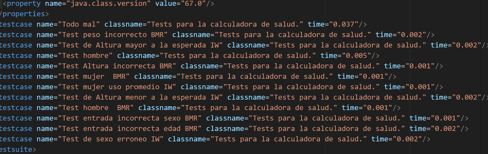
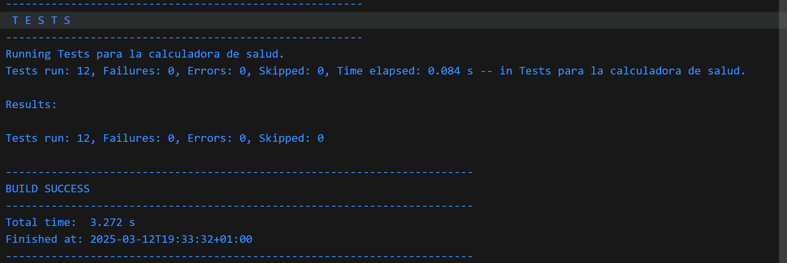

# isa2025-healthcalc
Health calculator used in Ingeniería del Software Avanzada

Se desea desarrollar una calculadora que permita estimar varios parámetros de salud de una persona, como su peso ideal, su tasa metabólica basal, entre otras funciones. Se recomienda usar la **Tabla de contenido** para visualizar las practicas por separado.

<details>
  <summary>Indice de Contenido</summary>
   <ol>
    <li><a href="#Practica 1">Practica1</a>
      <ol> <li><a href="#Introducción">Introducción practica1</a></li>
        <li><a href="#Desarrollo">Desarrollo de tests</a></li>
        <li><a href="#test_idealWeight">Test idealWeight</a></li>
        <li><a href="#test_basalMetabolicRate">Test basalMetabolicRate</a></li>
        <li><a href="#Ejecución">Ejecución de los test</a></li>
        <li><a href="#Repositorio">Desarrollo del repositorio practica1</a></li></ol> </li>
    <li><a href="#Practica 2">Practica2</a></li>
      <ol> <li><a href="#Introduccion">Introducción practica2</a>
        <li><a href="#Diagrama caso de uso">Diagrama de casos:</a></li>
        <li><a href="#Especificacion">especificación del caso de uso</a></li></ol> </li>
   </ol>
</details>

# Práctica 1

<a name="Practica 1"></a>

<a name="Introducción"></a>
# Introducción:
Dicho repositorio forma parte de las actividades de la asignatura "Ingeniería de software Avanzada" correspondiendo a la parte practica, [Partiendo de este repositorio](https://github.com/jmhorcas/isa2025-healthcalc.git)

Se busca desarrollar una herramienta de cálculo de salud que, utilizando datos como la estatura, el peso, la edad y el sexo, permita estimar valores como el peso óptimo y la tasa metabólica basal.

* `idealWeight`: Obtiene la altura y el género como entrada, y su salida es el **peso ideal**.
* `basalMetabolicRate`: Obtiene el peso, la altura, el género y la edad como entrada, y su salida es el **metabolismo basal**.  

 **IMPORTANTE** NO HE UTILIZADO LA FORMULA DADA YA QUE ME DABA ERROR, HE COGIDO LA FORMULA DE WIKIPEDIA

<a name="Desarrollo"></a>  
#  Desarrollo de tests:

El **testing** es un proceso clave en el desarrollo de software, ya que permite detectar y corregir errores antes de que afecten a los usuarios. Su importancia radica en varios factores:

Garantiza la calidad del software: Asegura que la aplicación funcione correctamente bajo diferentes condiciones y cumpla con los requisitos establecidos.

Reduce costos y tiempo de desarrollo: Detectar errores en etapas tempranas evita problemas más costosos de corregir en fases avanzadas o después del lanzamiento.

Previene riesgos en aplicaciones críticas: En sectores como la salud, finanzas o seguridad, el testing es vital para evitar errores que puedan generar daños o pérdidas significativas.
Mejora la experiencia del usuario: Un software libre de fallos mejora la usabilidad y la satisfacción de quienes lo utilizan.

Facilita el mantenimiento y escalabilidad: Un código bien probado permite realizar cambios y agregar nuevas funciones sin comprometer el funcionamiento existente.


<a name="Ejecución"></a>
# Ejecución de los test:
A continuación, se muestra una captura con los resultados de todas las pruebas exitosas. Para más detalles, se pueden revisar las imágenes almacenadas en la carpeta "images", donde se encuentran capturas de mayor calidad y con información más específica.

En total, se han implementado 12 pruebas, incluyendo algunas parametrizadas. Todas las pruebas se han ejecutado correctamente y cumplen con los objetivos establecidos desde el inicio.

Abra con su IDE el fichero “TEST-healthcalc.HealthCalcTest.xml” dentro de la carpeta “target/surefire-reports” que contiene el resultado de ejecutar los tests.





<a name="Repositorio"></a>
# Desarrollo del repositorio:
Durante el laboratorio, se utilizo `git` para trabajar de manera cómoda, eficiente y segura, pudiendo publicar continuamente los avances del proyecto, metodología muy útil para tener una mayor perspectiva de la linealidad del proyecto y poder retroceder en caso de equivocaciones.


<a name="Practica 2"></a>
# Práctica 2
# Introducción 

<a name="Introduccion"></a>
 En primer lugar la practica 2 consiste en **Gestión de respositorio git y Github** donde se crearán las ramas correspondientes a la practica 1 y practica 2, 
El segundo paso es  **La realización deun diagrama de casos de uso UML para la calculadora de salud** según lo visto en el tema 2, donde se usará la calculadora de la practica 1 más 2 funciones nuevas en caso de este trabajo:

1. La primera es calcular **el índice de masa corporal (IMB).** El IMB de una persona se calcula mediante la siguiente fórmula: `BMI = mass (kg) / height^2(m) `.

2. La segunda función será la **El cálculo de tu requerimiento calórico diario** depende de varios factores: edad, sexo, peso, altura, nivel de actividad física.

  Primero calcularemos la Tasa Metabolica Basal ya vista en la pratica 1:

      Hombres > TMB=(10×peso kg)+(6.25×altura cm)−(5×edad)+5.

      Mujeres > TMB=(10×peso kg)+(6.25×altura cm)−(5×edad)−161.
  
  Despues lo multiplicaremos por el nivel de actividad:

    Sedentario (poco o nada de ejercicio) → ×1.2
    Ligero (ejercicio ligero 1-3 días/semana) → ×1.375
    Moderado (ejercicio moderado 3-5 días/semana) → ×1.55
    Activo (ejercicio intenso 6-7 días/semana) → ×1.725
    Muy activo (entrenamiento muy intenso o trabajo físico fuerte) → ×1.9

Despues para terminar la práctica escogeremos uno de los casos de uso y lo especificaremos definiendo todas las características que considere oportunas (nombre, actor principal, ámbito, nivel, stakeholders e intereses, precondiciones, garantías mínimas, garantía de éxito, escenario principal, escenarios alternativos, extensiones,…).   

<a name="diagrama"></a>

# Diagrama de casos de uso:
Aqui presento el diagrama de caso de uso a implementar con los dos casos de la practica 1,el índice de masa corporal (IMB) y El cálculo de tu requerimiento calórico diario.

<p align="center">

</p>


<a name="Especificacion"></a>
# Especificación de Casos de Uso: función Basal Metabolic Rate:

**1.Stakeholders y sus intereses/objetivos:**

-Usuario: Quiere conocer su tasa metabólica basal para gestionar su ingesta calórica.

-Nutricionistas/Entrenadores personales: Usan la información para recomendar dietas y planes de entrenamiento.

-Aplicación/Sistema de Cálculo: Ofrece el servicio de cálculo y puede integrar funciones adicionales


**2.Actor principal:** 

Usuario(Persona interesada en concoer su BMR). 

**3.Alcance:** 

Aplicación HealthCalc (Calculadora de Salud).


**4.Precondición:** 

-El usuario debe proporcionar información personal básica: peso, altura, edad y sexo.

-La fórmula de cálculo debe estar correctamente implementada en el sistema


**5.Garantias:**

Minima-Se muestra un mensaje de error o resultado al usuario.

De éxito: El usuario obtiene un resultado correcto (su peso ideal).

Trigger: El usuario indica que quiere calcular un peso ideal (selecciona la opción de calcular Peso Ideal en el programa HealthCalc).

**6.Escenario principal:**
1.	El usuario selecciona la opción de calcular BMR en el programa.
2.	El sistema pide los parámetros (altura,sexo,edad y peso) al usuario. 
3.	El usuario introduce los valores de los parámetros.
4.	El sistema calcula su BMR.
5.	El sistema muestra en pantalla el BMR para los parámetros dados.

Escenario Alternativos:
3b) el usuario se equivoca al introducir algún parámetro
3b1) El sistema muestra un error (especificando que campo tiene el error y una posible razón) y vuelve al paso 2.


```

