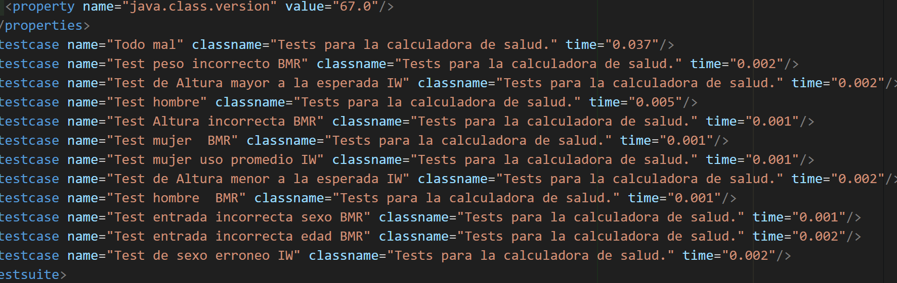
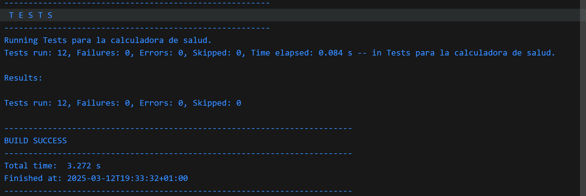

# isa2025-healthcalc
Health calculator used in Ingeniería del Software Avanzada

Se desea desarrollar una calculadora que permita estimar varios parámetros de salud de una persona, como su peso ideal, su tasa metabólica basal, entre otras funciones. Se recomienda usar la **Tabla de contenido** para visualizar las practicas por separado.

<details>
  <summary>Indice de Contenido</summary>
   <ol>
    <li><a href="#Practica 1">Practica1</a>
      <ol> <li><a href="#Introducción">Introducción practica1</a></li>
        <li><a href="#Desarrollo">Desarrollo de tests</a></li>
        <li><a href="#test_idealWeight">Test idealWeight</a></li>
        <li><a href="#test_basalMetabolicRate">Test basalMetabolicRate</a></li>
        <li><a href="#Ejecución">Ejecución de los test</a></li>
        <li><a href="#Repositorio">Desarrollo del repositorio practica1</a></li></ol> </li>
    <li><a href="#Practica 2">Practica2</a></li>
      <ol> <li><a href="#Introduccion">Introducción practica2</a>
        <li><a href="#Diagrama caso de uso">Diagrama de casos:</a></li>
        <li><a href="#Especificacion">especificación del caso de uso</a></li></ol> </li>
     <li><a href="#Practica 3">Practica3</a></li>
      <ol> <li><a href="#Introducción">Introducción practica3</a>
      <li><a href="#History Peso Ideal">User Story: Peso ideal de un persona:</a></li>
      <li><a href="#History Tasa Metabolica Basal">User Story:  Cálculo de la tasa metabólica basal de una persona:</a></li>
       <ol> <li><a href="#Aceptacion Peso Ideal">Criterios de aceptación</a></li></ol> </li>
       <li><a href="#Aceptacion Metabolica Basal">Criterios de aceptacion</a></li></ol> </li>

   </ol>
</details>

# Práctica 1

<a name="Practica 1"></a>

<a name="Introducción"></a>
# Introducción:
Dicho repositorio forma parte de las actividades de la asignatura "Ingeniería de software Avanzada" correspondiendo a la parte practica, [Partiendo de este repositorio](https://github.com/jmhorcas/isa2025-healthcalc.git)

Se busca desarrollar una herramienta de cálculo de salud que, utilizando datos como la estatura, el peso, la edad y el sexo, permita estimar valores como el peso óptimo y la tasa metabólica basal.

* `idealWeight`: Obtiene la altura y el género como entrada, y su salida es el **peso ideal**.
* `basalMetabolicRate`: Obtiene el peso, la altura, el género y la edad como entrada, y su salida es el **metabolismo basal**.  

 **IMPORTANTE** NO HE UTILIZADO LA FORMULA DADA YA QUE ME DABA ERROR, HE COGIDO LA FORMULA DE WIKIPEDIA

<a name="Desarrollo"></a>  
#  Desarrollo de tests:

El **testing** es un proceso clave en el desarrollo de software, ya que permite detectar y corregir errores antes de que afecten a los usuarios. Su importancia radica en varios factores:

Garantiza la calidad del software: Asegura que la aplicación funcione correctamente bajo diferentes condiciones y cumpla con los requisitos establecidos.

Reduce costos y tiempo de desarrollo: Detectar errores en etapas tempranas evita problemas más costosos de corregir en fases avanzadas o después del lanzamiento.

Previene riesgos en aplicaciones críticas: En sectores como la salud, finanzas o seguridad, el testing es vital para evitar errores que puedan generar daños o pérdidas significativas.
Mejora la experiencia del usuario: Un software libre de fallos mejora la usabilidad y la satisfacción de quienes lo utilizan.

Facilita el mantenimiento y escalabilidad: Un código bien probado permite realizar cambios y agregar nuevas funciones sin comprometer el funcionamiento existente.


<a name="Ejecución"></a>
# Ejecución de los test:
A continuación, se muestra una captura con los resultados de todas las pruebas exitosas. Para más detalles, se pueden revisar las imágenes almacenadas en la carpeta "images", donde se encuentran capturas de mayor calidad y con información más específica.

En total, se han implementado 12 pruebas, incluyendo algunas parametrizadas. Todas las pruebas se han ejecutado correctamente y cumplen con los objetivos establecidos desde el inicio.

Abra con su IDE el fichero “TEST-healthcalc.HealthCalcTest.xml” dentro de la carpeta “target/surefire-reports” que contiene el resultado de ejecutar los tests.





<a name="Repositorio"></a>
# Desarrollo del repositorio:
Durante el laboratorio, se utilizo `git` para trabajar de manera cómoda, eficiente y segura, pudiendo publicar continuamente los avances del proyecto, metodología muy útil para tener una mayor perspectiva de la linealidad del proyecto y poder retroceder en caso de equivocaciones.


<a name="Practica 2"></a>
# Práctica 2
# Introducción 

<a name="Introduccion"></a>
 En primer lugar la practica 2 consiste en **Gestión de respositorio git y Github** donde se crearán las ramas correspondientes a la practica 1 y practica 2, 
El segundo paso es  **La realización deun diagrama de casos de uso UML para la calculadora de salud** según lo visto en el tema 2, donde se usará la calculadora de la practica 1 más 2 funciones nuevas en caso de este trabajo:

1. La primera es calcular **el índice de masa corporal (IMB).** El IMB de una persona se calcula mediante la siguiente fórmula: `BMI = mass (kg) / height^2(m) `.

2. La segunda función será la **El cálculo de tu requerimiento calórico diario** depende de varios factores: edad, sexo, peso, altura, nivel de actividad física.

  Primero calcularemos la Tasa Metabolica Basal ya vista en la pratica 1:

      Hombres > TMB=(10×peso kg)+(6.25×altura cm)−(5×edad)+5.

      Mujeres > TMB=(10×peso kg)+(6.25×altura cm)−(5×edad)−161.
  
  Despues lo multiplicaremos por el nivel de actividad:

    Sedentario (poco o nada de ejercicio) → ×1.2
    Ligero (ejercicio ligero 1-3 días/semana) → ×1.375
    Moderado (ejercicio moderado 3-5 días/semana) → ×1.55
    Activo (ejercicio intenso 6-7 días/semana) → ×1.725
    Muy activo (entrenamiento muy intenso o trabajo físico fuerte) → ×1.9

Despues para terminar la práctica escogeremos uno de los casos de uso y lo especificaremos definiendo todas las características que considere oportunas (nombre, actor principal, ámbito, nivel, stakeholders e intereses, precondiciones, garantías mínimas, garantía de éxito, escenario principal, escenarios alternativos, extensiones,…).   

<a name="diagrama"></a>

# Diagrama de casos de uso:
Aqui presento el diagrama de caso de uso a implementar con los dos casos de la practica 1,el índice de masa corporal (IMB) y El cálculo de tu requerimiento calórico diario.

<p align="center">

</p>


<a name="Especificacion"></a>
# Especificación de Casos de Uso: función Basal Metabolic Rate:

**1.Stakeholders y sus intereses/objetivos:**

-Usuario: Quiere conocer su tasa metabólica basal para gestionar su ingesta calórica.

-Nutricionistas/Entrenadores personales: Usan la información para recomendar dietas y planes de entrenamiento.

-Aplicación/Sistema de Cálculo: Ofrece el servicio de cálculo y puede integrar funciones adicionales


**2.Actor principal:** 

Usuario(Persona interesada en concoer su BMR). 

**3.Alcance:** 

Aplicación HealthCalc (Calculadora de Salud).


**4.Precondición:** 

-El usuario debe proporcionar información personal básica: peso, altura, edad y sexo.

-La fórmula de cálculo debe estar correctamente implementada en el sistema


**5.Garantias:**

Minima-Se muestra un mensaje de error o resultado al usuario.

De éxito: El usuario obtiene un resultado correcto (su peso ideal).

Trigger: El usuario indica que quiere calcular un peso ideal (selecciona la opción de calcular Peso Ideal en el programa HealthCalc).

**6.Escenario principal:**
1.	El usuario selecciona la opción de calcular BMR en el programa.
2.	El sistema pide los parámetros (altura,sexo,edad y peso) al usuario. 
3.	El usuario introduce los valores de los parámetros.
4.	El sistema calcula su BMR.
5.	El sistema muestra en pantalla el BMR para los parámetros dados.

Escenario Alternativos:
3b) el usuario se equivoca al introducir algún parámetro.
3b1) El sistema muestra un error (especificando que campo tiene el error y una posible razón) y vuelve al paso 2.


<a name="Practica 3"></a>
# Práctica 3

<a name="Introducción"></a>
# Introducción: 

Las historias de usuario son descripciones breves y sencillas de una funcionalidad de software desde la perspectiva del usuario final. Se utilizan en el desarrollo ágil para capturar los requisitos del usuario de una manera que sea fácil de entender y priorizar.

A su vez se usará Cucumber que es una herramienta para automatizar pruebas BDD (Desarrollo Guiado por el Comportamiento). Es decir pruebas que se centran en el comportamiento del sistema y utiliza lenguaje natural para definir pruebas automatizadas.


* **Objetivo:**

Implementar historias de usuario y criterios de aceptación siguiendo la metodología BDD (Desarrollo Guiado por el Comportamiento), a través de Gherkin y Cucumber.

La metodología BDD (Desarrollo Guiado por el Comportamiento) se enfoca en describir el comportamiento de la aplicación desde la perspectiva del usuario, utilizando un lenguaje sencillo y comprensible para todos los involucrados. Gherkin es el lenguaje utilizado para escribir las especificaciones de comportamiento, y Cucumber es la herramienta que ejecuta estas especificaciones como pruebas automatizadas.

* **Estructura:**

**Historias de usuario:** Se redactan con el formato "Como [rol de usuario], Necesito [funcionalidad], Para [objetivo o beneficio]", permitiendo describir claramente los requerimientos y metas de los usuarios.

**Criterios de aceptación:** Se estructuran de la siguiente manera: "Dado que [situación o contexto], Cuando [evento o acción], Entonces [resultado esperado]", con el fin de definir cómo debe comportarse el sistema en distintos escenarios.

*  **Beneficios:**

**Enfoque en el usuario:** Las historias de usuario ayudan a los equipos de desarrollo a centrarse en las necesidades del usuario.

**Comunicación clara:** Las historias de usuario son fáciles de entender para todos los miembros del equipo, incluidos los no técnicos.

**Flexibilidad:** se pueden adaptar fácilmente a los cambios en los requisitos.

**Priorización:** pueden priorizar según su valor para el usuario.

**Colaboración:** Las historias de usuario fomentan la colaboración entre el equipo de desarrollo y el usuario.


<a name="History Peso Ideal"> </a>
## User Story:  Cálculo del peso ideal.

Utilizo la estructura implementada en la introducción para definir la historia de usuario del Peso ideal:

**Como usuario de la calculadora de salud, necesito calcular el peso ideal para los parámetros dados 
Para poder saber el peso ideal**

<a name="History Tasa Metabolica Basal"> </a>
## User Story:  Cálculo de la tasa metabólica basal.

 El use story será muy parecido al caso de peso ideal porque como su nombre lo indica la idea es seguir una plantilla y un sistema que a pesar de estar en lenguaje natural el programa sea capaz de automatizar parte de los test

Utilizo la estructura implementada en la introducción para definir la historia de usuario de la Tasa Metabolica Basal:

**Como usuario de la calculadora de salud, quiero calcular la tasa metabólica basal para los parámetros dados, para poder saber la tasa metabólica basal.**


<a name="Aceptacion Peso Ideal"> </a>

## Criterio de Aceptación:  Cálculo del peso ideal de un persona.

Esquema del escenario: altura no válida
Dado que tengo una calculadora de salud.
Cuando calculo el peso ideal para una altura no válida <h>
Entonces la calculadora lanza una excepción.

Esquema del escenario: género no válido
Dado que tengo una calculadora de salud.
Cuando calculo el peso ideal para un género no válido <g>
Entonces la calculadora lanza una excepción.

Esquema del escenario: resultado negativo
Dado que tengo una calculadora de salud.
Cuando calculo el peso ideal para el sexo <g> y la altura <h> y da un resultado negativo
Entonces la calculadora lanza una excepción.

Esquema del escenario: resultado de peso ideal
Dado que tengo una calculadora de salud.
Cuando calculo el peso ideal para el sexo <g> y la altura <h>
Luego la calculadora da un resultado <valor>


<a name="Aceptación Metabolica Basal"> </a>

## Criterio de Aceptación: Tasa metabólica basal de una persona

Esquema del escenario: altura no válida
Dado que tengo una calculadora de salud.
Cuando calculo la tasa metabólica basal de una altura inválida <h>
Entonces la calculadora lanza una excepción.

Esquema del escenario: genero no válido
Dado que tengo una calculadora de salud.
Cuando calculo la tasa metabólica basal de un género no válido <g>
Entonces la calculadora lanza una excepción.

Esquema del escenario: edad incorrecta
Dado que tengo una calculadora de salud.
Cuando estimo la tasa metabólica basal de una edad negativa <a>
Entonces la calculadora lanza una excepción.

Esquema del escenario: peso incorrecto
Dado que tengo una calculadora de salud.
Cuando calculo la tasa metabólica basal de un peso no válido <w>
Entonces la calculadora lanza una excepción.

Esquema del escenario: resultado correcto
Dado que tengo una calculadora de salud.
Cuando estimo la tasa metabólica basal para los parámetros válidos dados <w>, <h>, <g>, <a>
Entonces la calculadora arroja un resultado válido <resultado>


```
